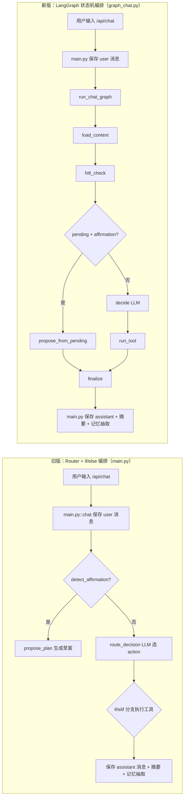
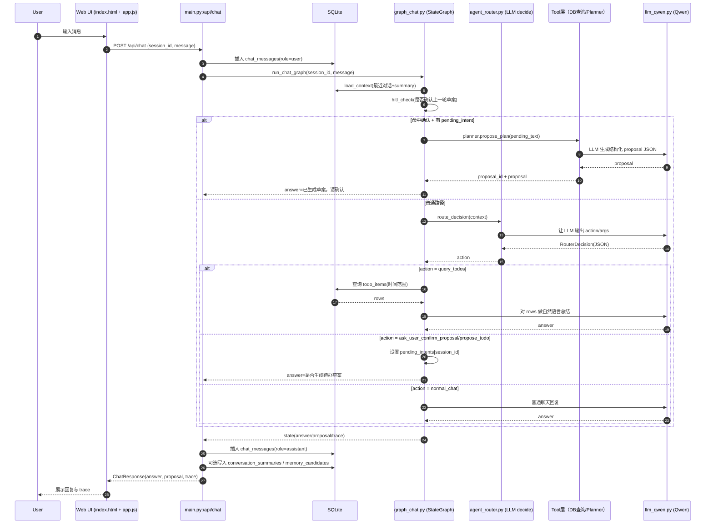
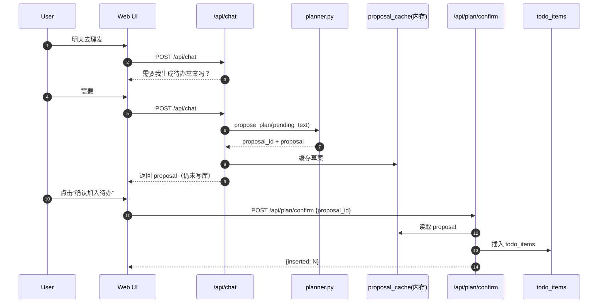
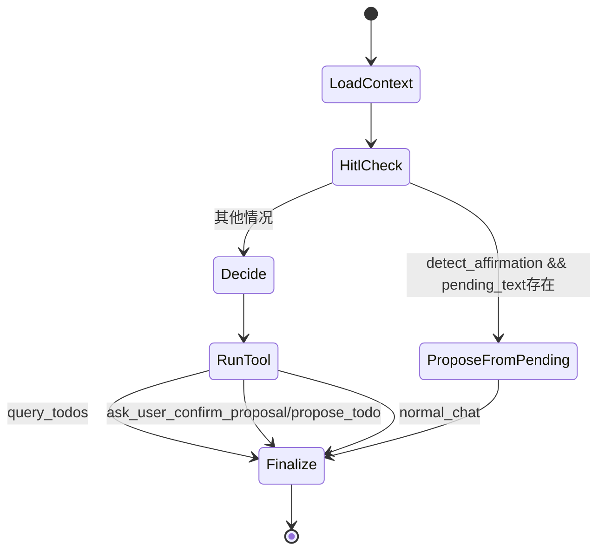

# LifeOps-Agent 架构图（旧版 vs LangGraph 新版）

> 本文档可直接放到仓库中用于讲解系统设计，包含：
> 1) 时序图（Sequence）
> 2) 状态图（State Machine）
> 3) 数据表流向图（Data Flow）
>
> 图示重点文件：`lifeops/main.py`、`lifeops/graph_chat.py`、`lifeops/agent_router.py`、`lifeops/planner.py`、`lifeops/retrieval.py`。

---

## 1. 总览：旧版与新版编排差异（框 + 箭头）



---

## 2. 时序图（Sequence）：从用户输入到回复

### 2.1 新版聊天主链（LangGraph）



### 2.2 HITL 写入待办（二阶段）



---

## 3. 状态图（State Machine）：LangGraph 聊天图



### 状态说明

- `LoadContext`：加载最近对话与会话摘要。
- `HitlCheck`：检查“确认词 + 待确认意图”是否同时成立。
- `ProposeFromPending`：从 pending 文本生成草案（不直接写入 todo）。
- `Decide`：调用 Router LLM 决策 action。
- `RunTool`：根据 action 执行工具。
- `Finalize`：兜底 answer、补 trace，回传给 `main.py`。

---

## 4. 数据表流向图（Data Flow）

```mermaid
flowchart TB
    U[用户消息] --> A[/api/chat]
    A --> B[(chat_messages)]

    A --> C[LangGraph 执行]
    C --> D{action}

    D -->|query_todos| E[(todo_items)]
    D -->|propose_todo| F[(pending_intents 内存)]
    D -->|normal_chat| G[LLM 直接回复]

    C --> H[answer/proposal/trace]
    H --> I[(chat_messages: assistant)]

    I --> J[_maybe_update_summary]
    J --> K[(conversation_summaries)]

    I --> L[memory_extractor]
    L --> M[(memory_candidates)]

    subgraph RAG[知识库链路（独立于 /api/chat）]
      X[/api/index] --> Y[扫描 docs_dir + OCR/PDF/TXT]
      Y --> Z[(document_chunks)]
      Q[/api/ask] --> S[search_chunks 三路召回]
      S --> Z
      S --> T[rag_answer]
      T --> W[answer + citations]
    end
```

---

## 5. 关键设计结论（面试可直接讲）

1. 新版将“流程控制”从 `main.py` 的分支逻辑上移到 `LangGraph`，提升可维护性。
2. HITL 被建模为显式状态转移：未确认只到 proposal，不会写入 `todo_items`。
3. trace 从“结果日志”升级为“节点级执行轨迹”，更易审计与定位问题。
4. 聊天编排链路与 RAG 链路解耦：`/api/chat` 与 `/api/ask` 可独立演进。
5. 数据层使用 SQLite：消息、待办、摘要、记忆候选、文档块均可落库追溯。

